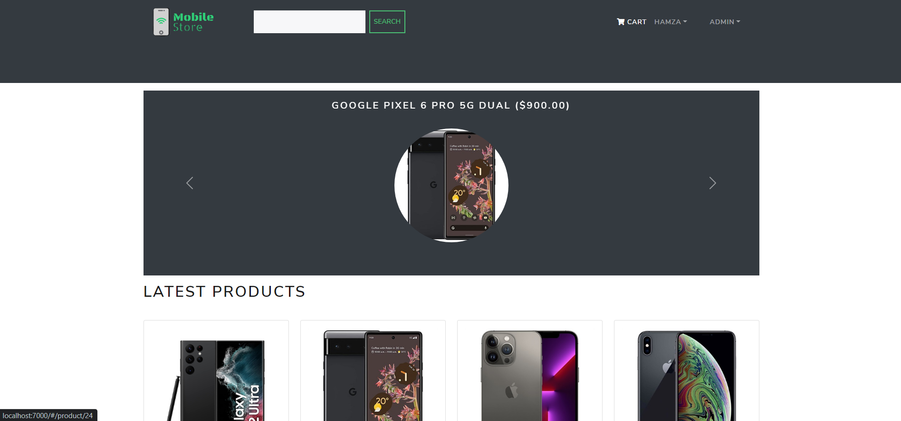
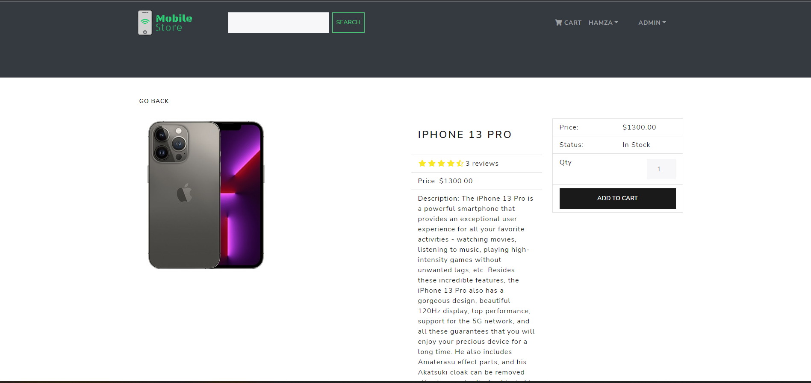
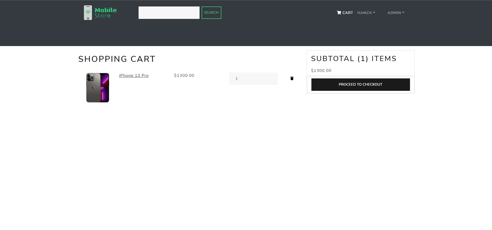
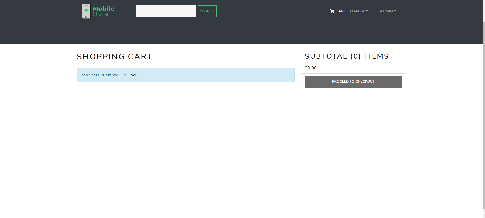
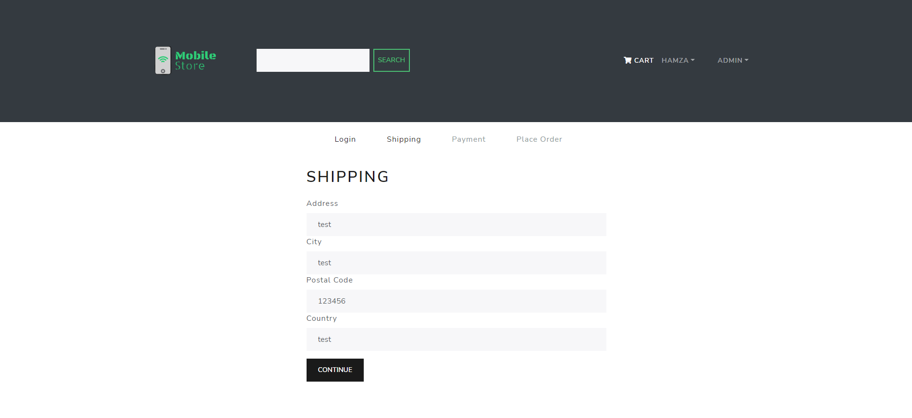
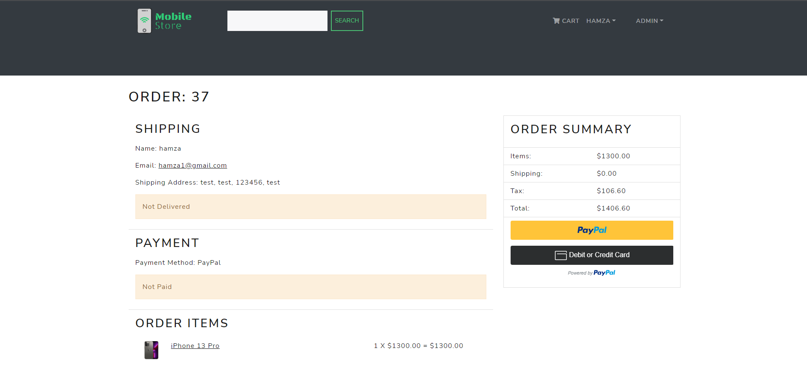

<h1 align=center>E-Commerce Website with Django + React </h1>
<h2 align=center>Mobile Store</h2>

### How to Run ️

```shell
1 Clone This Repo
2 python -m venv env
3 .\env\Scripts\activate
4 pip install -r requirements.txt 
5 python manage.py runserver

```

###  Project Screenshots








### Project Features

A completely customized eCommerce / shopping cart application using Django, REACT with the following functionality:

- Full featured shopping cart
- Product reviews and Ratings
- Top products carousel
- Product pagination
- Product search feature
- User profile with orders
- Admin product management
- Admin user management
- Admin Order details page
- Mark orders as a delivered option
- Checkout process (shipping, payment method, etc)
- PayPal / credit card integration


### Tests
- Unit tests
- Integration tests
- E2E tests (using selenium)
- STP AND STD attached

### Tools
- Selenium
- Jenkins
- Docker
- NGROK
- Jira


